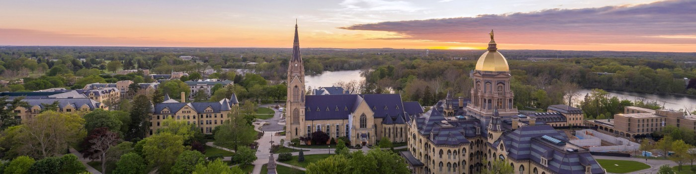

# Hi, I'm Quinn! 👋

I'm a senior at the **University of Notre Dame**, studying **biology and data science**. I'm curious about the intersection of data and health, and I enjoy exploring this relationship technically and ethically. This profile showcases my **programming progression** and **data literacy** through ongoing data science projects.

## About Me
- 🎓 Currently taking Introduction to Data Science
- 🌱 Learning Python, pandas, and data visualization
- 📫 How to reach me: qshannon@nd.edu

## Interests
- 🩺 I'm interested in public health and medicine
- ☀️ In my free time, I love to read and spend time outdoors
- 🏆 Fun fact: I am recently an intramural soccer champ!

## Skills I'm Learning
    

## Projects
[Data Science Portfolio](https://github.com/qfshannon/Shannon-Data-Science-Portfolio)

## Goals
- I aspire to develop a **strong foundation in data science**; I will achieve this growth by completing projects that test my **data analysis and communication** skills.
- I hope to gain **experience with data methods** that I can apply to medicine and public health.

## Let's Connect

